# Projeto Final DMO1 - EcoRec (Aplicativo de Tecnologia Social)

## Descrição do Projeto

### Autores 👤

O projeto do Aplicativo Móvel de Tecnologia Social da EcoRec foi criado pelos alunos do curso de Análise e Desenvolvimento de Sistemas no IFSP - Campus Araraquara abaixo:
- **Gabriel de Pauli Santos.**
- **Gabriel Ventura Pires.**
- **Cauã Grigolatto Domingos.**
- **Rauan Caracciolo.**

### Tecnologias utilizadas 👩‍💻

- **Kotlin:** Linguagem de programação utilizada no Projeto.
- **Room:** Utilizado para efetuar a persistência de dados.
- **Arquitetura MVVM (Model-View-ViewModel):** Utilizado na Organização do código.
- **SQLite:** Utilizado para gerenciamento do Banco de Dados relacional.
- **Aplicativos:** Android Studio

## Sobre o projeto ℹ

Este projeto é uma aplicação Android (desenvolvida no Android Studio) com linguagem Kotlin que tem o objetivo de conectar usuários a centros de reciclagem, buscando promover a conscientização ambiental e o descarte correto dos lixos recicláveis. No aplicativo, o usuário poderá visualizar os centros de reciclagem registrados no sistema, além dos tipos de descartes aceitos por cada centro em específico. Os administradores do sistema possuem funções de cadastrar novos centros de reciclagem, cadastrar materiais, realizar a associação de cada centro com os materiais coletados por ele e também realizar modicação de dados, tanto do centro quanto dos materiais.
**OBS: Login do administrador ("admim") e senha do administrador ("admim") pré-cadastrados.**

- **Página Inicial:** Esta página possui uma mensagem de "Bem-Vindo!"e uma imagem de apresentação, junto com duas opções de botões, "Logar como Admin" e "Acessar Dados".

- **Acessar Dados:** Este botão encaminha para uma página (Activity) onde aparecerão as informações dos centros cadastrados e ao clicar em cima do nome do centro desejado irão aparecer os materiais associados a cada um deles. **OBS: Esta página possui também um botão (ícone de seta) para voltar para a página inicial.** 

- **Logar como Admin:** Este botão encaminha para uma página (Activity) onde será necessário efetuar o login com "Usuário" e "Senha", após o sistema efetuar a verificação de login ele encaminhará para página de ações do Admin se os dados de login inseridos estiverem corretos, mas caso estejam incorretos ele gera uma mensagem de erro. **OBS: Esta página de login possui a opção de seleção ("Manter Logado") para o usuário se manter logado no sistema.**

- **Menu do Admin:** Esta página (Activity) possui 5 botões com as ações que o Administrador pode realizar, estas opções de ação são "Cadastrar Centro", "Cadastrar Material", "Registrar Relação", "Modificar Dados" e "Logout".

- **Cadastrar Centro:** Este botão encaminha para uma página (Activity) onde será possível cadastrar o Centro de Reciclagem. Aqui para que o cadastro seja efetuado, será solicitado o nome do centro e também seu endereço. Caso seja registrado com sucesso, aparecerá uma mensagem na tela (Toast) de sucesso e caso ocorra algum problema será exibido uma mensagem de erro na tela (Toast). **OBS: Esta página possui também um botão (ícone de seta) para voltar para o menu do administrador.** 

- **Cadastrar Material:** Este botão encaminha para uma página (Activity) onde será possível cadastrar um material. Aqui para que o cadastro seja efetuado será necessário a inserção apenas do nome do mesmo. Caso seja registrado com sucesso, aparecerá uma mensagem na tela (Toast) de sucesso e caso ocorra algum problema será exibido uma mensagem de erro na tela (Toast). **OBS: Esta página possui também um botão (ícone de seta) para voltar para o menu do administrador.** 
 
- **Registrar Relação:** Este botão encaminha para uma página (Activity) onde será possível realizar a inclusão dos materias que cada centro em específico descarta. Para que seja realizada esta inclusão o administrador deve insirir o ID do centro e o ID do material que deseja associar. Caso seja registrado com sucesso, aparecerá uma mensagem na tela (Toast) de sucesso e caso ocorra algum problema será exibido uma mensagem de erro na tela (Toast). **OBS: Esta página possui também um botão (ícone de seta) para voltar para o menu do administrador.** 

- **Modificar Dados:** Este botão encaminha para uma página (Activity) onde pode filtrar por centro de reciclagem ou materiais, após selecionar o filtro será listado todos os itens (centros de reciclagem ou materiais), assim o administrador ao clicar no ícone do lápis poderá realizar as alterações dos dados de um item em específico (centro de reciclagem ou material), podendo também efetuar a exclusão do item ao clicar no ícone de lixeira em frente a seus dados. Caso seja modificado ou excluído com sucesso, aparecerá uma mensagem na tela (Toast) de sucesso e caso ocorra algum problema será exibido uma mensagem de erro na tela (Toast). **OBS: Esta página possui também um botão (ícone de seta) para voltar para o menu do administrador.** 
 
- **Logout:** Este botão encerra a sessão do Administrador, o deslogando do sistema.

## Tutorial de Instalação ⬇️

Para que o aplicativo funcione corretamente, siga os passos abaixo:

## Screenshots do Sistema em funcionamento 📷

### - Página Inicial

Esta é a página inicial onde é possível escolher a opção de "Login" ou "Acessar Dados".

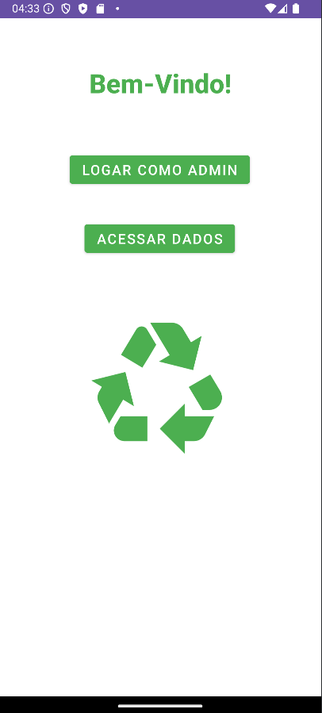

### - Página de Login

Esta é a página onde será possível efetuar o Login do usuário.

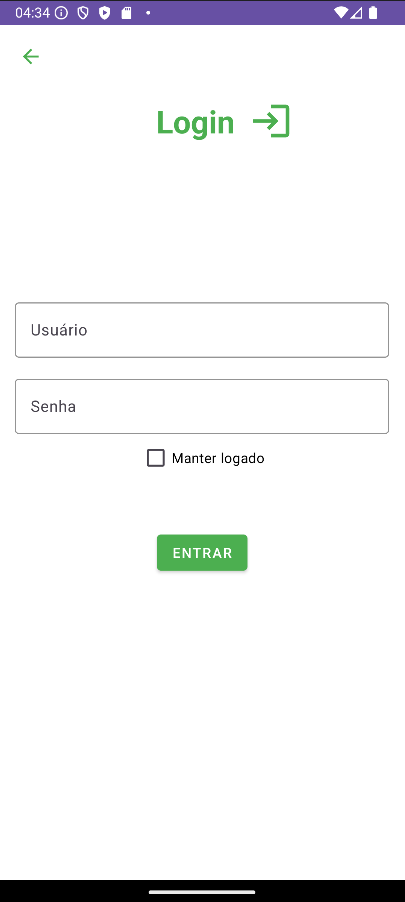

### - Menu do Usuário

Esta é a página onde aparecerá o Menu de opções do Usuário.

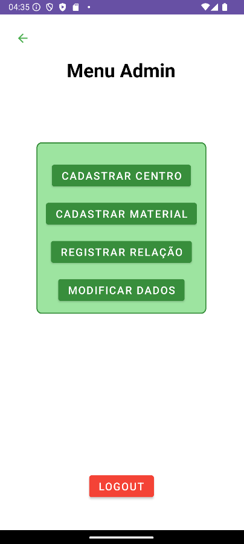

### - Página de Cadastrar Centros

Esta é a página onde será possível cadastrar um Centro de Reciclagem.

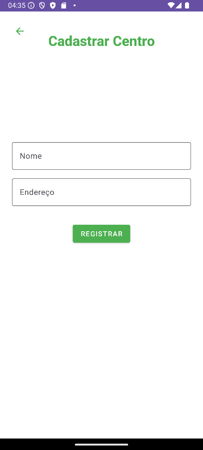

### - Página de Cadastrar Material

Esta é a página onde será possível cadastrar um Material.

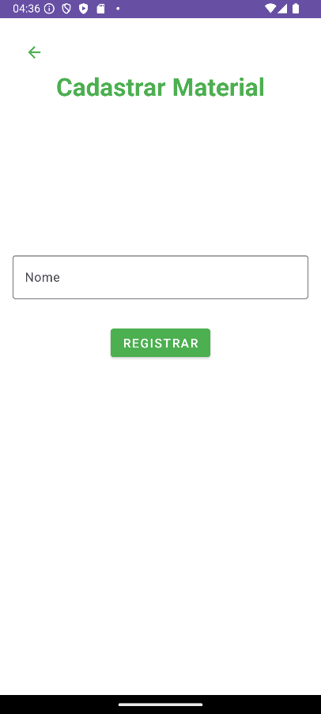

### - Página de Registrar Relação

Esta é a página onde será possível associar um Material com um Centro de Reciclagem em específico.

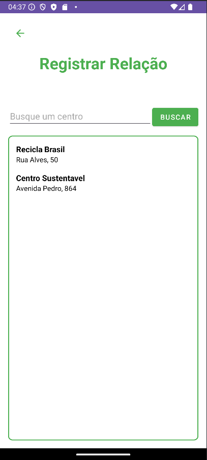

### - Registrando Relação

Momento em que está sendo registrada a relação de um Centro com os Materiais desejados.

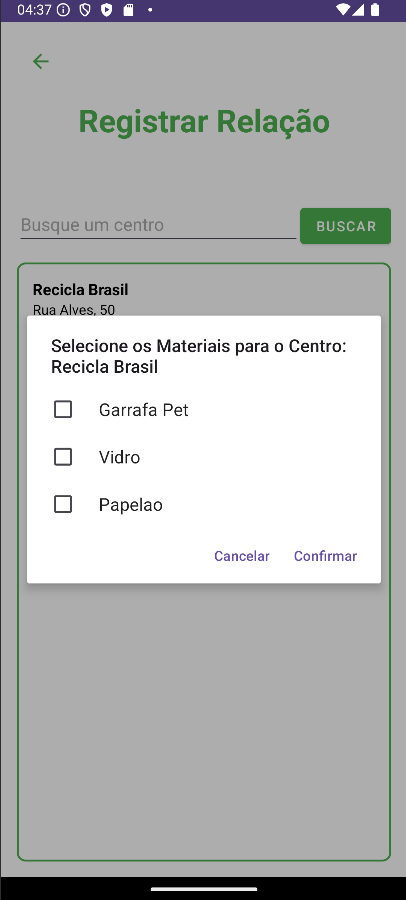

### - Página de Modificar Dados (Centros de Reciclagem)

Esta é a página onde é possível modificar ou excluir os dados dos Centros ou dos Materiais, aqui nesta imagem estamos filtrando os "Centros".

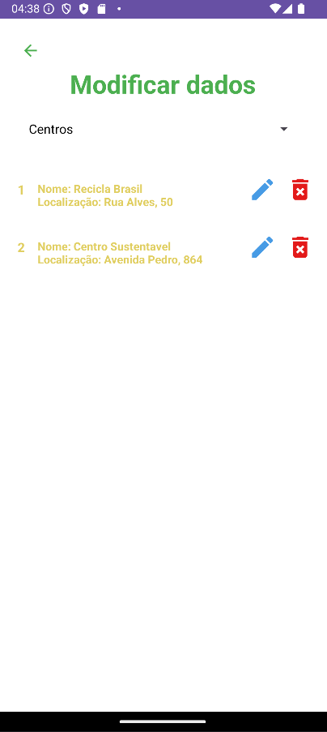

### - Modificando os Centros

Momento em que está sendo modificado as informações do Centro de Reciclagem.

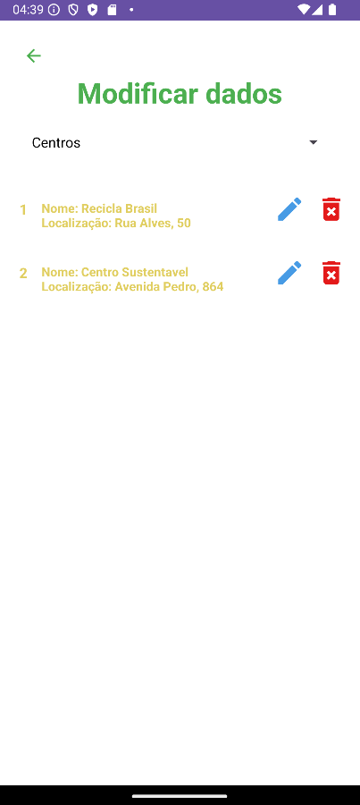

### - Página de Modificar Dados (Materiais)

Esta é a página onde é possível modificar ou excluir os dados dos Centros ou dos Materiais, aqui nesta imagem estamos filtrando os "Materiais".

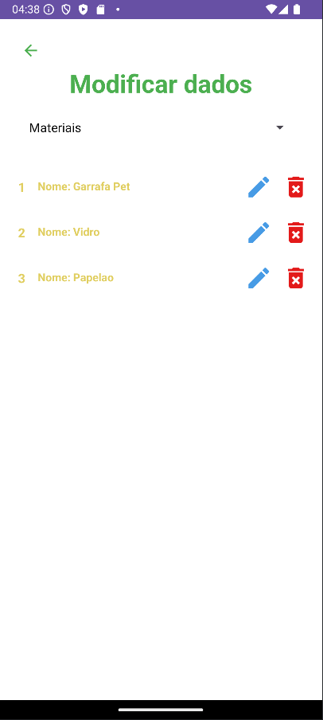

### - Modificando os Materiais

Momento em que está sendo modificado as informações do Material.

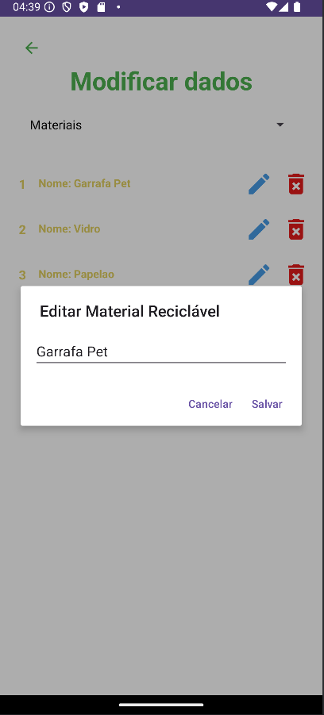

### - Página de Acessar Dados

Esta é a página onde é possível visualizar os Centros de Reciclagem registrados e os materias associados a cada um, além de filtrar os centros por material.

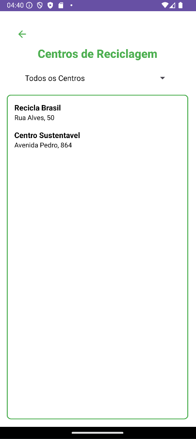

### - Página de Acessar Dados

Esta é a página onde é possível visualizar os Centros de Reciclagem registrados e os materias associados a cada um, além de filtrar os centros por material.

### - Filtro do Centro pelo Material

Aqui está a exibição do filtro de seleção do material que está buscando descartar.

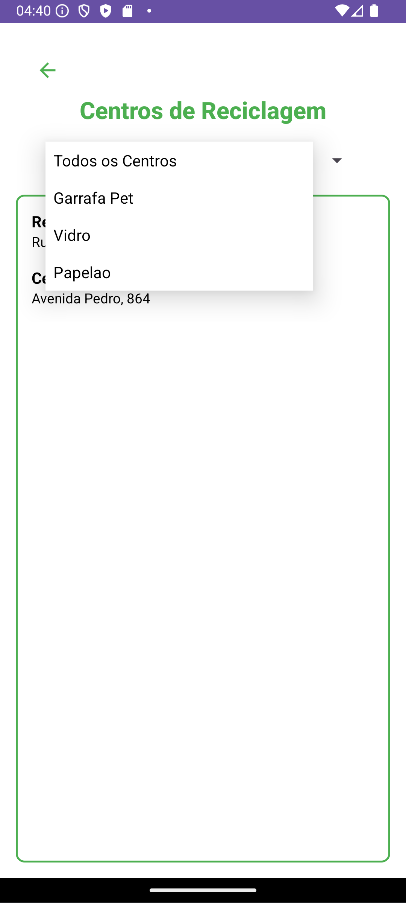

### - Após selecionar o Filtro do Material

Aqui está a exibição da página e dos Centros após selecionar um Material em específico para descartar.

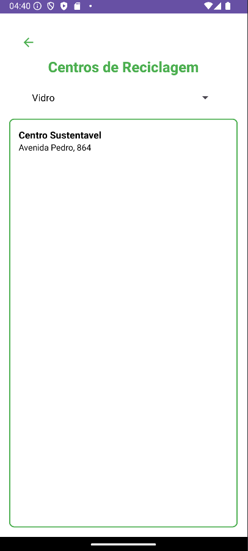

### - Visualizando os Materiais do Centro selecionado

Aqui está a exibição da lista de Materiais que o Centro em específico aceita.

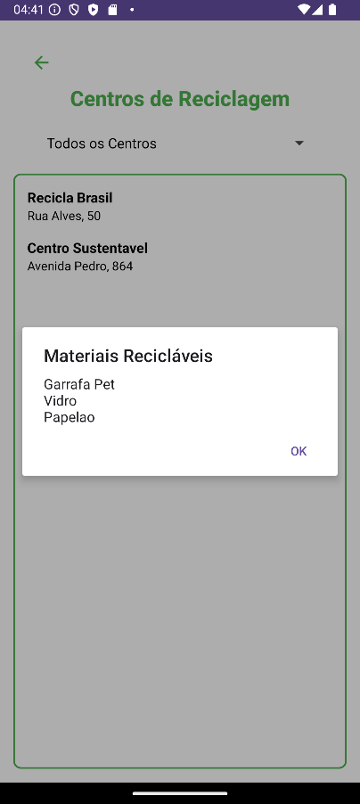
